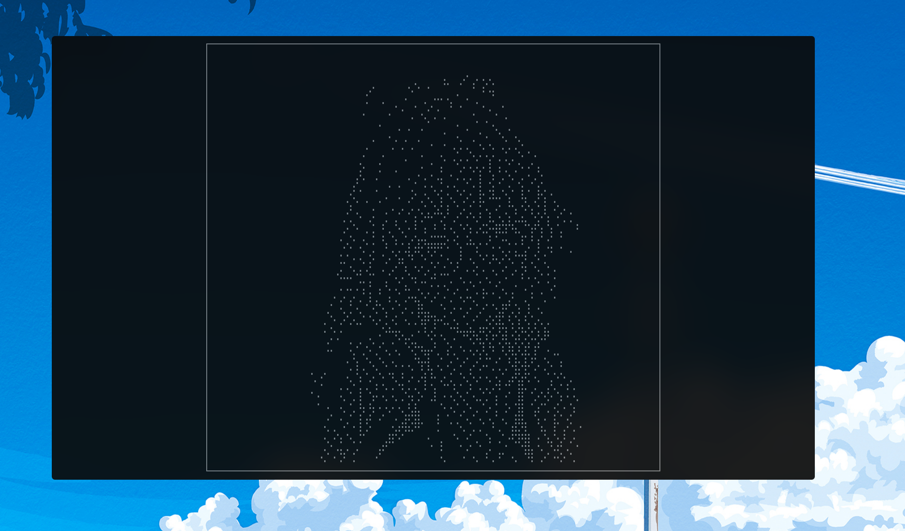

## What does Raifus do ❓
Raifus is a command-line tool written in Rust that displays an anime waifu in ascci characters.

The overall purpose of Raifus is to be used in screenshots of your system rice.

## Support me 🤝

[](https://www.buymeacoffee.com/sponkurtus2)

## Installation 🔨
```cargo install Raifus``` <br>


## About ✨
This is another of my random projects as a Student, and it was pretty fun to code, because it gave me an
introduction to some Rust concepts.
